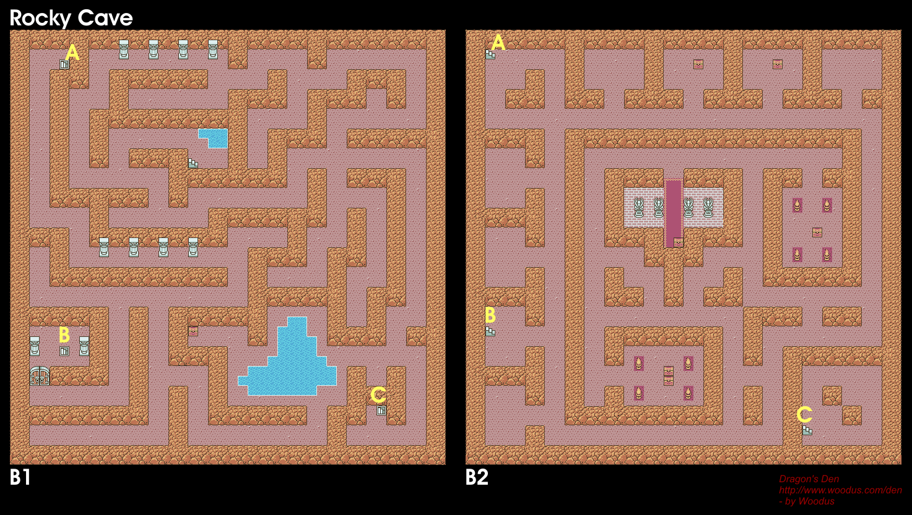

# Dragon Warrior

Any % run on Emulator. I own the game on IPad, but that's not exactly a runnable
form. I've based my route off of a speed run from an [RPG Limit Break][1] run.

NOTE: Time starts after name is selected, and enter hit.

## Pixie Flute (Split 1)

  * Name your character Gyre for stat manipulation towards more strength.
  * Grab the first 3 chests, and the pot downstairs to the right.
  * Enter the town to the right of the castle.
  * Weapons Shop - Club
  * Go to the inn and take the warp wing from the drawers in the bottom right.
  * Item Shop (Bottom Right) - Dragon Scale/2 Torch/2 Herb
  * Equip
    * Weapon - Club
    * Accessory - Dragon Scale
  * Leave town.
  * Walk along forests and mountains (increased encounter rate) to get in fights
    to gain levels and head to Kol (North East part of the map). If you fight a
    Spooky you should use a torch, Scorpion run away.
  * Enter Kol and pickup the PixieFlute from in front of the guy just below the
    pool.

## Choker (Split 2)

  * Open the drawers to the far right (Clothes) and 2nd from the left (Strength
    seed).
  * Menu
    * Equip - Clothing
    * Strength Seed.
  * Leave Kol and head to Garinham (North West part of the map). You should get
    to Level 4 before entering.
  * Stay at the inn.
  * Item Shop (Top Left) - Dragon Scale/Torch/Herbs until item slots are full.
  * Head to the Moutain Cave. 
  * Use a torch.
  * Head to the 2nd floor, and pick up the Strength Seed. Use it, then pick up
    the Mystic Nut. Stay on the second floor and pick up the iron shield as
    well.
  * Go to the Choker chest and don't discard any items until you get it. RNG as
    far as when it will show up, but you can keep trying as long as you don't
    free up a spot in the inventory.

## (Split 3)

  * Pick up the chest with 570G in the room to the left.

[1]: https://www.youtube.com/watch?v=umtL8f2YkY0