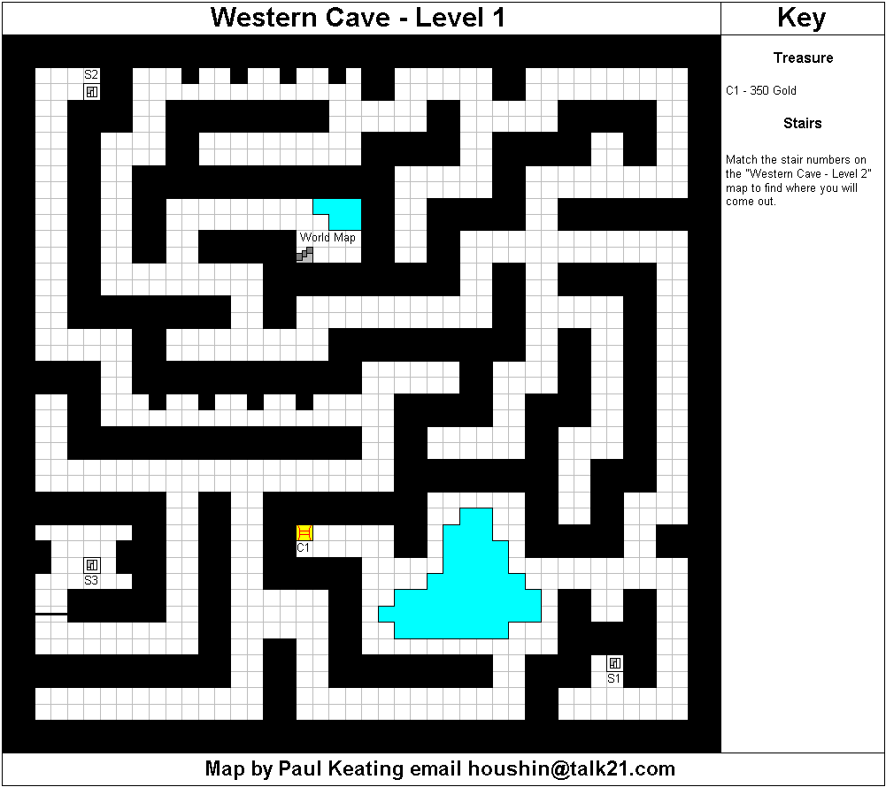
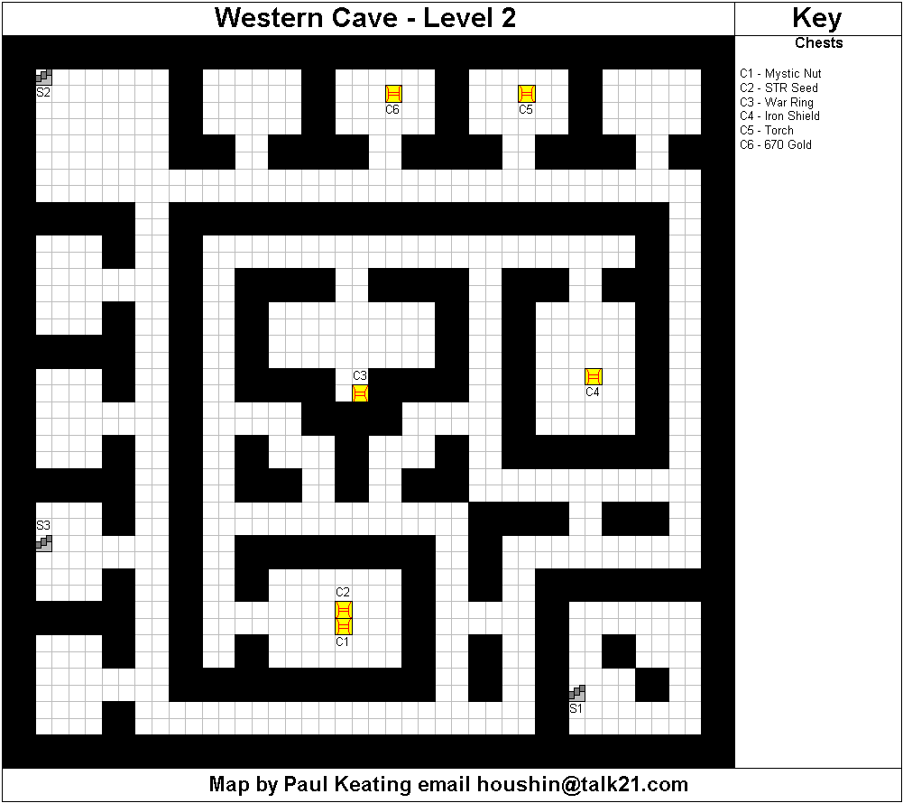
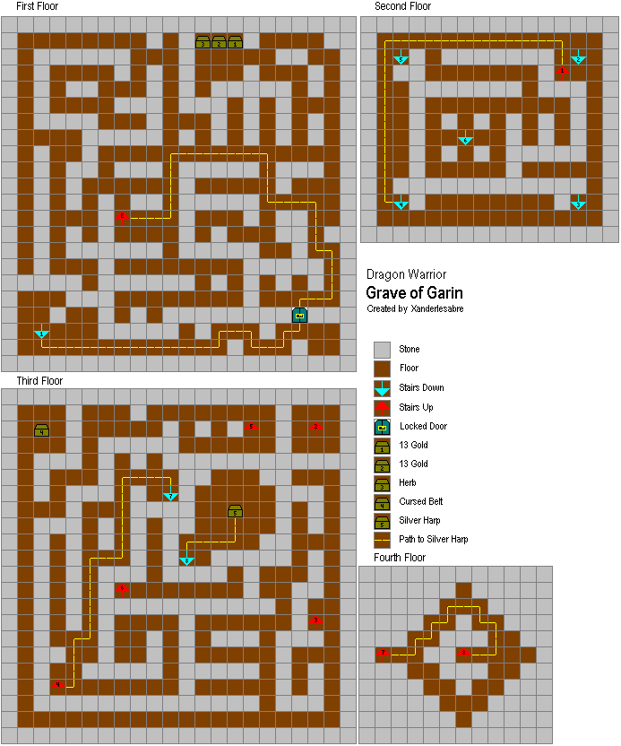

# Dragon Warrior

Any % run on Emulator. I own the game, but an emulator is the easiest way to
play it with my setup. I've based my route off of a speed run from an
[RPG Limit Break][1] run, as well as a PB from [EvilAsh25][Evil Ash] that he did
right before RPG Limit Break.

## General Information

### Level Guide

| Level | Experience | Spell        |
|-------|------------|--------------|
| 1     | 0          | ---          |
| 2     | 7          | ---          |
| 3     | 23         | Heal         |
| 4     | 47         | Hurt         |
| 5     | 110        | ---          |
| 6     | 220        | ---          |
| 7     | 450        | Sleep        |
| 8     | 800        | ---          |
| 9     | 1,300      | Radiant      |
| 10    | 2,000      | Stopspell    |
| 11    | 2,900      | ---          |
| 12    | 4,000      | Outside      |
| 13    | 5,500      | Return       |
| 14    | 7,500      | ---          |
| 15    | 10,000     | Repel        |
| 16    | 13,000     | ---          |
| 17    | 16,000     | Healmore     |
| 18    | 19,000     | ---          |

### Threat Counter

For each step you take, the threat counter will rise. This includes steps in
town. You can utilize this to force encounters out of town earlier than you
normally would get them from just walking around.

**NOTE: Time starts after name (DRsh) is selected, and enter hit.**

## Level 4 (Split 1)

  * [Name][Naming Information] your character Gyre for stat manipulation towards
    more strength and HP. Take a look at the name guide to modify the name to
    your liking if you wish.
  * Grab the first 3 chests (120 gold, torch, key).
  * Enter the town to the right of the castle.
  * Weapons Shop - Club
  * Go to the inn and take the warp wing from the drawers in the bottom right.
  * Item Shop (Bottom Right) - Dragon Scale/2 Torch/2 Herb
  * Equip
    * Weapon - Club
    * Accessory - Dragon Scale
  * Leave town.
  * Walk along forests and mountains (increased encounter rate) to get in fights
    to gain levels and head to Kol (North East part of the map). You shouldn't
    cross the damage steps until Level 2, but after that you should move across
    and use an herb as necessary. Suggestion is 10 or less HP.
  * After you get to Lvl 2 you can move towards Kol and use torches to kill a
    stronger monster. Torches do 4-6 damage, and you should kill a stronger
    monster to get to level 3 before entering Kol. Ideally you have low HP, and
    can die to the damage tiles in there.
  * Enter Kol and pickup the PixieFlute from in front of the guy just below the
    pool.
  * Open the drawers to the far right (Clothes) and 2nd from the left (Strength
    seed).
  * Die to the damaging floor, and warp back to the castle. If you are close to
    full health you can also take a fight outside of Kol (hopefully magdracky)
    who will either kill you or give you good exp if you are lucky.
  * Make sure you save as this next menu will be to ensure a good strength seed
    roll. You have 2 strength seeds before Golem, and you want to roll between
    5 and 6 total. Seeds give between 1-3.
  * Menu
    * Strength Seed (if you roll a 1 reset and try again)
    * Equip - Clothing
  * Leave Kol and head West. You should get to Level 4 before crossing the
    bridge.

## Choker (Split 2)

  * After crossing the bridge fight a couple of fights using Fireball, and then
    head to Kol (North).
  * Item Shop (Top Left)
    * Max out on herbs, and buy torches until you have 2.
  * Head to the Western Cave.
    
    
  * You can fight Magicians, but should Fireball anything else. Recommendation
    is to save fireballs for high value targets like scorpion, or drakeemas who
    generally die in 1 fireball, or 1 fireball and 1 hit.
  * Use a torch.
  * Head to the 2nd floor, and pick up the Strength Seed and MysticNut. DONT USE
    THEM! You need a full inventory for the choker chest.
  * Stay on the second floor and pick up the iron shield as well. You must come
    out of this with a full set of items for the next part.
  * Go to the Choker chest and don't discard any items until you get it. RNG as
    far as when it will show up, but you can keep trying as long as you don't
    free up a spot in the inventory.

## Level 7 (Split 3)

  * Pick up the chest with 570G in the room to the left.
  * Fight enemies trying to die and return to the castle.
  * Make sure you save at the king.
  * Menu
    * Strength Seed (If you don't get a 2 or 3 to get you to 5-6 strength from
      the seeds reset.)
    * Mystic Nut
    * Toss Cloth Armor
    * Equip Iron Shield
  * Use the warp wing to teleport outside.
  * Head to the swamp cave fighting any enemy you come across.
  * Go through the cave and go to Rimuldar. Go to the "secret" area at the top
    left of the city and enter the shop. Take the 120G from the left pot, and
    the Defense Seed from the right. Buy a full assortment of keys (6) as well.
  * Exit the city, fight an enemy and re-enter. Your threat counter would have
    went up in the city, so you should be able to fight an enemy earlier than
    normal. Go to the inn and use 2 keys to get the life acorn in the bottom
    right. Use it and stay at the inn.
  * Weapon Shop (Top Right)
    * Sell - Club/Choker
    * Buy - Steel Sword
  * Grab the warp wing from the drawers to the left of the Weapon Shop, then
    talk to the merchant above the shop.
  * Shop
    * Buy - 2 warp wings/Herbs until you run out of space/torch
  * Use a warp wing.
  * Enter the castle and go to the treasure room. Open the chest with the mystic
    nut (2nd from bottom) and agility seed (bottom), and use them. Then open all
    of the other chests. Replenish your keys in the upper right of the castle,
    then go to the sages room.
  * Open right drawer for the Life Acorn.
  * Talk to the sage and get the sun stone.
  * Menu
    * Life Acorn
    * Warp wing to skip the dialogue.
  * Head to Garinham.
  * Stay at the inn.
  * Weapon Shop
    * Buy - Chain Mail
  * Enter the locked door above the inn.
    Then enter the cave.
    
  * Use the torch on the first floor, and grab the 3 chests with a Life Acorn,
    Key, and money.
  * Pick up the Shiny Harp, and use it to get into fights to get to at least
    Lvl 7. After Lvl 7 fight ~5 enemies (you want to be in the 100 exp range for
    the next level) then take a death.

## Golem (Split 4)

  * Use a warp wing to leave.
  * Head to Cantlin. You should fight battles with weak enemies and metal slimes
    only. If unsure, run. You want to be at Lvl 8 for the Golem fight. Note the
    susceptibility to sleep for most enemies to allow for easier runs.
    ShadowKnight you should just run from however.
  * **[Golem][Golem Info] (124-137 HP)**
    * Use the Pixie Flute to keep him asleep and stay healed.
    * You can usually do 2 turns before he wakes up, and you should be doing
      somewhere between 10-13 damage, so you can likely assume 11 hits to kill.
    * _Exp Given 2500 -> 3300 Total_

## Dragon Loop: Level 12 (1 Dragon) (Split 5)

  * Use all herbs to clear up inventory, and then go drop off all items except
    the sword/shield/armor and keys.
  * Go to the inn and pick up the Defense seed from the drawers and stay at the
    inn.
  * Go to the item shop and buy a warp wing.
  * Go down from the item shop, and open the drawers for a mystic nut.
  * Go to the bottom shop and buy repellent. Use 1, the mystic nut, the defense
    seed, then fill your inventory with the rest. Use the warp wing.
  * Head to the swamp cave (using repellent 3 steps out of the top damage
    tiles), and cast heal, then radiant. Then go and fight the dragon. Note you
    can't use a repellent in the cave.
  * **Dragon (165 HP)**
    * You should be around 60-65 HP.
    * Start with 2 attacks, then heal if you are at or around 30 HP.
    * You should be doing somewhere between 16-21 per attack, so it's safe to
      assume 10 attacks to kill.
    * **Script**
      * 3 Attacks
      * 3 Heals
      * 2 Attacks
      * 3 Heals
      * 2 Attacks
      * 3 Heals (Can 2 heal if you feel like you will go first)
      * 3 Attacks
    * _Exp Given 950 -> 4250 Total_

## Dragon Loop: Level 13 (3 Dragons) (Split 6)

  * Cast outside, then die to the swamp.
  * Head to the dragon healing before radiant. Should be 8 attacks this time,
    but it can also be 9. The script below is setup for 9 attacks, as I think
    safety and quick inputs is more important than risking it and guessing.
    Fight him twice using the same steps. And return the 2nd time instead of
    dying.
  * **Script**
    * 3 Attacks
    * 3 Heals
    * 2 Attacks
    * 2 Heals
    * 2 Attacks
    * 2 Heals
    * 2 Attacks
  * _Exp Given 1900 -> 6150 Total_

## Dragon Loop: Level 14 (5 Dragons) (Split 7)

  * Head to the nearby town and max out on repellents (top right item shop
    (needs key)). Then head to the keys shop and max out your keys, then die to
    the damage steps there.
  * Fight the dragon twice. 7-8 attacks, heal before radiant.
    * **Script**
      * 3 Attacks
      * 3 Heals
      * 2 Attacks
      * 3 Heals
      * 3 Attacks
  * _Exp Given 1900 -> 8050 Total_

## Dragon Loop: Lvl 15 (7 Dragons) (Split 8)

  * Fight the dragon twice. 6-7 attacks, heal before radiant.
  * **Script**
    * 4 Attacks
    * 1 Heal
    * 3 Attacks
  * _Exp Given 1900 -> 9950 Total_

## Dragon Loop: Refill those Keys (8 Dragons) (Split 9)

  * Menu
    * Un-Equip the Iron Shield
    * Cast Outside
  * Once outside die to the damage tiles.
  * Fight the dragon once. Don't heal before casting radiant in the cave, and
    mash your 6 hits out.
  * After Dragon fight 8 replenish keys back at the castle.
  * _Exp Given 1900 -> 11850 Total_

## Dragon Loop Lvl 16 (11 Dragons) (Split 10)

  * Fight the Dragon 3 more times.
  * _Exp Given 1900 -> 13750 Total_

## Dragon Loop: Rainbow Staff (13 Dragons) (Split 11)

  * Fight the Dragon 2 more times. 5 hits, use an item once, don't heal before
    radiant.
  * Go pick up your items from the town. Scale, harp, and the Sun Stone.
  * Go pick up the RainStaff to the NorthEast of here.
  * If you are more than 1200 exp away from Lvl 17, go fight the dragon.

## Level 17 and the Seal (Split 12)

  * Cast Return and head to the Ruined City and fight the MadKnight guarding the
    armor.
  * **MadKnight (67 HP)**
    * Just keep attacking, casting HealMore if you really need it.
  * Pick up the Loto Armor.
  * Menu
    * Equip the Loto Armor.
  * Go to the swamp under Caitlin and grab the Loto Seal.
  * Fight until Level 17

## DragonLord's Castle (Split 13)

  * Go to the Southern Cave with the RainStaff and the Sun Stone to create the
    Rainbow Droplet to cross the bridge.
  * Go back to Rimuldar and buy a key. Step outside and cast repel.
  * Re-enter to max out with herbs and a torch. Also stay at the inn.
  * Go to the DragonLord's castle.
  * Go get the Loto Sword.
    ![DragonLord Castle Map][2]
  * Equip the Loto Sword in the DL fight.

## DragonLord 1 (Split 14)

  * **DragonLord (HP 200)**
    * You need what is basically 7 attacks (31-36 per hit), and his healmore
      spell takes away 2+ of them. 2 Healmores is basically -5 hits. Crits count
      as ~3 hits.

## DragonLord 1 (Split 15)

  * **DragonLord Dragon Form (HP 350)**
    * Go in a 1-2-3-4 cycle here, where 1 and 2 are strong attacks, 3 is a weak,
      and 4 is a medium/strong. As long as you control your HP here, you should
      be able to handle this fight with a bit of good luck on speed. You need
      probably around 14-15 hits assuming 22-25 damage each time. Honestly you
      need a crit in a bad way here.
  * Return to the castle.
  * Time ends when the king finishes talking to you.

[1]: https://www.youtube.com/watch?v=umtL8f2YkY0
[2]: ./DragonLord_Castle.gif
[Golem Info]: ./golem.md
[Naming Information]: ./GBC_Names.ods
[Evil Ash]: http://twitch.tv/evilash25