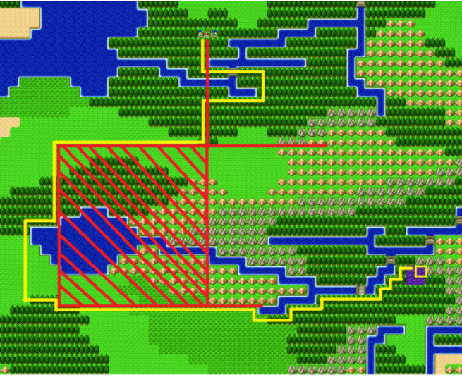
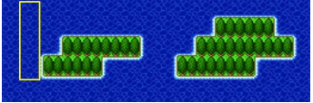

# Dragon Warrior 2

Any % run on Emulator. I own the game, but an emulator is the easiest way to
play it with my setup. I've based my route off of a speed run from
[Twitchpoppop][Twitchpoppop], as well as these [notes][DQ2 Notes] made by
[StarOfViolence][StarOfViolence].

## General Information

This game is very difficult and you will die a lot. This game is largely
encounter based, and how well you handle encounters will determine how well you
do on the run.

**NOTE**: Time starts when you input a name and select your message speed. The
          name should be short as it doesn't affect anything, and set the
          message speed to the fastest possible.

## Maps

### Overworld

Use this [Map][Overworld Map] to have an idea of the overworld.

### Most Maps

Use this [Map Page][Map Page] when you need specific maps.

## Buy all the things! (Split 1)

  * After the longest cutscene ever, grab the items out of the chest, and then
    head south to the shop.
  * Shop
    * **Note**: This will differ depending on when you get the token. You are
                looking to get 3 tokens out of this so you can stock up on
                items (herbs and shields). Use this [guide][Buy Guide] by
                [EvilAsh25][EvilAsh25] to correctly purchase items.
    * Both versions of the buys are very similar, with the only real difference
      being when you do a sell/buy herb which is keyed off of if you get a token
      for the first herb buy or not.
  * Now exit the town and head northwest to Cannock Castle. Flee from
    everything.
  * Enter Samarutoria and speak to the King. Once in the town head to the right,
    then up, then left to get to him. Don't save.
  * Leave, then travel east to the Spring of Bravery. Flee everything.
  * Once you are in the Spring of Bravery, head up and to the right until you
    can't go up anymore, then left and down.
  * Talk to the old man here, and then deathwarp back to the castle.
  * Head west from the castle to Leftwayne.
  * Head to the inn (up a bit, and to the right) to pick up the prince.
  * Head to the item shop (bottom left) and follow the Leftwayne portion of this
    [guide][Buy Guide] to get your gold and items.

## Princess Mary (Split 2)

  * Head Northwest through the forest to the Cannock Monolith. You should get
    the main character to Lvl 3, and the Prince to Lvl 2 before entering.
  * Talk to the guards and enter. Head straight down to exit. If a good fight
    shows up fight, otherwise flee.
  * Once you get outside, stay close to the exit and fight until you get to Lvl
    3 with the prince. This gets you fireball and 16 MP so you can use it often.
    If you die, then revive the prince and walk back fighting "every" encounter.
    If you are low on mp, then skip.
  * Head South to Hamlin.
  * Stay at the inn, and talk to the old man at the NorthEast side of town just
    outside the church to save your game. Head back out.
  * Head to the swamp with Ra's Mirror following the route shown
    . Stay healed up with the Prince, and run
    from most battles.
  * After you get the mirror use a Chimera Wing to return to Hamlin.
  * Heal at the Inn, and revive any dead members.
  * Use the LarMirror to turn the dog into the Princess.

## Lighter than a Feather (Split 3)

  * Fight around town to get the Princess to Lvl 2 (Sleep), staying at the inn
    if necessary.
  * Head Southwest to Moonbrook Castle. Try to fight in the mountains to get
    some LizardFlies. Your ideal level heading in to the castle is 6/5/2.
  * Once you are in the castle flee unless you have good healing capabilities.
    Multiple living dead are an absolute no go.
  * Head up and to the left to circle back and enter the basement. Grab the
    LifeAcorn from the first sand patch here. Use it on the prince, and then
    chimera wing back to town.
  * Heal up your party.
  * Head to the Tower of Wind. You will want to go NorthEast from Hamlin then
    follow the outer path next to the water all the way down to get there.
  * Fight simple groups of enemies to get to around 7/6/4 entering the Tower.
    Good idea to sleep ArmorPedes and Baboons.
  * Head up the tower grabbing the 350 gold, Cloak of Wind, and Wizard Ring.
  * Once you have the ring use a Chimera Wing to go back to Hamlin. If you have
    less than 1500 gold, then fight to the east until you have enough, then
    enter.
  * Shop
    * Buy - Steel Sword (Hero)
    * Sell - Copper Sword (Prince)
  * Equip
    * Prince: Chain Sickle <- Hero
    * Prince: Wind Mantle <- Hero
    * Princess: Prayer Ring <- Hero
    * Princess: All Herbs <- Hero
  * Head Southwest past Moonbrooke castle to the Moonbrooke Monolith. Cross here
    then head north west to get to the Dragon's Horns South entrance.
  * Go up the stairs to the right and continue circling the pit up the stairs to
    the very top. Jump off while the wind cape is equipped to land on the other
    side.

## Gold Key (Split 4)

  * Go in the North Horns and go up to floors, then take 1 step up and 2 left to
    get Dew's Yarn.
  * Exit and head east to Lianport.
  * Once you have 1250 Gold enter and use the inn and church to heal up. Also
    save.
  * Shop
    * Buy - Evade Clothes (Princess)
  * Fight the Gremlins.
  * **Gremlins (48-60 HP each)**
    * Hero - Attack
    * Prince - Fireball
    * Princess - Infernos
  * After the fight get the boat, then go to the top left of the town to get the
    Strength seed. Heal your party and sail away.
  * Head north keeping track of the island to your right. As soon as it goes out
    of sight watch for 8 bobs of the boat, then head west. You should see a
    couple of . Go to the west most part of these
    islands and then sail North.
  * Once you see the shrine go back until you can't see it, and force a battle.
    Enemies close to the shrine will wipe you, so just don't fight them.
  * Head in to Zahan.
  * Shop
    * Buy - Warp Wing (Hero)
    * Buy - Repellent (Hero)
    * Buy - Warp Wing (Princess)
    * Buy - Warp Wing (Princess)
    * Buy - Repellent (Princess)
  * Get the gold key 3 steps down, and 1 to the left of the top right of the
    village.

## Loto Shield (Split 5)

  * Leave Zahan and enter the shrine. Then warp to Midenhall Castle.
  * Head to the right to raid the Treasury. Open all but the first chest to get
    a LifeAcorn, StrSeed, MysticNut, the Loto Seal, and 1200 gold.
  * Menu
    * LifeAcorn (Prince)
    * MysticNut (Princess)
  * Head to the King and save.
  * Menu
    * StrSeed (2) (Hero) - Must be a total of 3 or higher.
  * Warp back to the Zahan Shrine, then go south until it's out of sight. Then
    head west 16 bobs of the boat, then head north to the fire shrine.
  * Enter the shrine and take the right most warp. Grab the helmet, then warp
    back.
  * Go to the tree on the right side of the shrine.
  * Equip
    * Loto Helmet (Prince)
  * Check your feet for the Sun Crest.
  * Leave the Shrine and sail directly west to the World Tree. Pick up a leaf.
    Make sure this ends up on the Hero.
  * Sail West to Wellgarth and after getting to 2000 gold land and enter.
  * Head to the Item shop to buy the Jailor Key (Empty free slot).
  * Head to the Jail, and enter the top right cell and go behind the wall to get
    the Dam Key.
  * Leave town, and sail south until you hit land. Then head east a bit and land
    to go South to Cannock Castle.
  * Shop
    * Sell - Leather Shield (Hero)
  * Pick up the Loto Shield by going towards the king, but stopping off for the
    chest in the middle of town.
  * Equip
    * Loto Shield (Hero)
  * Stop by the inn if needed, then head back to the ship and sail west to Lake
    Cave.

[Twitchpoppop]: https://www.twitch.tv/twitchpoppop
[StarOfViolence]: https://www.twitch.tv/starofviolence
[EvilAsh25]: https://www.twitch.tv/evilash25
[Buy Guide]: http://i.imgur.com/mlgPb7H.jpg
[DQ2 Notes]: https://drive.google.com/file/d/0B_t2B70DSnP9WHJKU1pGRVJETUE/view
[Overworld Map]: http://www.nesmaps.com/maps/DragonWarrior2/DragonWarrior2OverworldMap.html
[Map Page]: http://www.realmofdarkness.net/dq/games/snes/dq2/maps/dungeon