# Pokemon Red

Any% run using an emulator currently (I own the 3DS Digital Version, but don't
want to get the hookups for it). I've based my notes off of the ones found
[here][1], and a [WR][7] run by [Gunnermaniac][8].

## Useful General Information

### Red Bar

Getting your health into red bar keeps pokemon from doing their cry at the
beginning of the fight. This can save a second or 2 depending on the pokemon. Of
course it's pretty risky to be at low health the whole game, but no risk no
reward after all.

### Horn Drill and X Accuracy

Horn Drill is an instant kill move, but it's really hard to hit. That is why we
use X Accuracy before using it. X Accuracy removes the accuracy check before an
attack, meaning every hit after an X Accuracy is guaranteed to land.

### Hidden Items

We collect a lot of hidden items in the route, so it's useful to know where most
of them are. I try to have images any time you need to pick something up, but
[here][4] is a good catalog of the hidden items through the game.

## Before Staring (Split 0)

  * Clear any existing save file by pressing Up + B + Select on the game title
      screen 
  * Set text speed to FAST, battle animation to OFF and battle style to SHIFT

## Gary 1 (Split 1)

  * Give yourself and rival a one character name.
  * Wander to the grass North of town to be stopped by Professor Oak.
  * Choose Squirtle (2nd pokeball) and give it a one character name.
  * **Gary**
    * _Bulbasaur Lvl 5_
    * Tail whip, then spam tackle. If growled on turn 1, then do a 2nd tail
      whip. Use a potion if under 5 HP.
    * _Reach Lvl 6_

## Nidoran (Split 2)

  * Head North to Viridian City.
  * Fight a Lvl 2-3 Rattata or Pidgey for the experience. You need this for
    bubble to fight Brock.
  * Get Oak's Parcel from the Mart on the East side of town, then head back to
    Pallet Town to return it. Walk to the left of Oak to save some steps from
    Gary.
  * Head back to Viridian City.
  * Mart
    * Buy - 8 PokeBalls
  * Head West to Route 22.
  * Catch a Lvl 3 or 4 Nidoran (Male) in the first grassy area you see and give
    it a one character name. Tackle Lvl 3 Nidorans once before PokeBall. Lvl 4
    just chuck a PokeBall at unless low on balls, then tackle twice.

## Brock (Split 3)

  * Pick up the hidden tree potion North of Viridian City. It's at the Cut bush
    just past the old man you see on the North side of town.
  * Head to Viridian Forest.
  * Follow the path to get through the forest with minimal battles.
    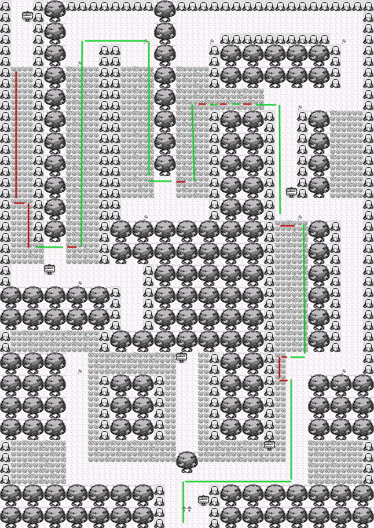
  * Pick up the antidote on the way up.
  * Heal to 10+ HP for Weedle Guy and for safety you can pick up the potion
    before him. 
  * **Weedle Guy**
    * _Weedle Lvl 9_
    * **NOTE: If you get poisoned, wait until after the fight to use the
              Antidote. If you fall below 7 HP, use a Potion.**
    * Tail Whip/Tail Whip/Tackle/Tackle/Tackle/Tackle
    * _Reach Lvl 8 (Squirtle)_
  * Switch Nidoran to the front.
  * Heal to 17+ HP.
  * Heal poison if necessary.
  * Continue on to Pewter Gym. Save before Brock if in a race.
  * **Brock**
    * _Geodude Lvl 12, Onyx Lvl 14_
    * Immediately switch in Squirtle.
    * Bubble/Bubble/Bubble
    * **Switch in Nidoran after killing Geodude, then immediately switch
        Squirtle back in. If Onyx uses Bide on the turn you swap Squirtle in,
        then tail whip twice, followed by bubble.**
    * Bubble/Bubble/Bubble
    * _Reach Lvl 8_
  * [Level 8 Nidoran Stat Ranges][3]

## Enter Mt Moon (Split 4)

  * Change the battle style to Set.
  * Mart
    * Buy - 7 Potions
  * Head to Mt. Moon
  * **_Finish enemies with tackle when it will kill. You need to save 1 horn
    attack here._**
  * **Bug Catcher 1**
    * _Caterpie Lvl 10, Weedle Lvl 10, Caterpie Lvl 10_
    * Leer/Horn Attack/Horn Attack
    * Leer/Horn Attack/Horn Attack
    * Horn Attack/Horn Attack/Tackle
    * _Reach Lvl 10_
  * _Save before Youngster if you are in a race_
  * Probably want to potion to full health here as Rattata can be tough.
  * **Youngster**
    * _Rattata Lvl 11, Ekans Lvl 11_
    * Horn Attack/Horn Attack/Tackle
    * Leer/Horn Attack/Horn Attack
    * _Reach Lvl 12_
  * At the start of the next fight swap Horn Attack with Leer so that it is in
    move slot 1.
  * **Bug Catcher 2**
    * _Weedle Lvl 9, Kakuna Lvl 9, Caterpie Lvl 9, Metapod Lvl 9_
    * Horn Attack/Horn Attack
    * Horn Attack/Horn Attack/Horn Attack
    * Horn Attack/Horn Attack
    * Horn Attack/Horn Attack/Tackle
    * _Reach Lvl 13_
  * **Bug Catcher 3**
    * _Caterpie Lvl 11, Metapod Lvl 11_
    * Horn Attack/Horn Attack
    * Horn Attack/Horn Attack
    * _Reach Lvl 14_
  * Catch a Spearow or a Pidgey in the grass patch ahead. Use Poison Sting to
    weaken Lv. 5 Spearows, Horn Attack to weaken Lv. 8 Pidgeys and Tackle to
    weaken everything else.
  * Use the Pokemon Center.
  * Enter Mt. Moon

## Exit Mt. Moon (Split 5)

  * Follow the path (no Water Gun).
    
    
    
  * _If you see a Paras catch it. Horn Attack to weaken (Tackle if Lvl
    difference is 8)._
  * **Super Nerd**
    * _Magnemite Lvl 11, Voltorb Lvl 11_
    * Horn Attack/Horn Attack/Horn Attack
    * Horn Attack/Horn Attack/Poison Sting
    * _Reach Lvl 15_
  * Pick up the Rare Candy and Escape Rope.
  * **Lass**
    * _Oddish Lvl 11, Bellsprout Lvl 11_
    * Horn Attack/Horn Attack/Horn Attack
    * Horn Attack/Horn Attack
    * _You should reach Lvl 16 and evolve here._
  * Pick up the Moon Stone.
  * Use the Moon Stone 1 step before fighting the Rocket.
  * **Rocket**
    * _Rattata Lvl 13, Zubat Lvl 13_
    * Horn Attack/Poison Sting
    * Horn Attack/Horn Attack
  * **Super Nerd**
    * _Grimer Lvl 12, Voltorb Lvl 12, Koffing Lvl 12_
    * Horn Attack/Horn Attack
    * Horn Attack/Horn Attack
    * Horn Attack/Horn Attack/Horn Attack
    * _Reach Lvl 17_
  * Select the Helix Fossil
  * Exit the Cave

# Nugget Bridge (Split 6)

  * Head to Cerulean City and use the Pokemon Center.
  * Get the hidden Rare Candy behind the top-left house.
    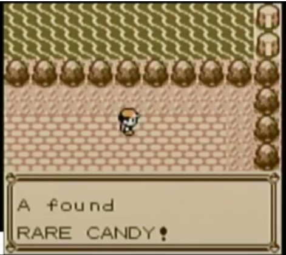
  * **Gary 2**
    * _Pigeotto Lvl 18, Abra Lvl 15, Rattata Lvl 17, Bulbasaur Lvl 17_
    * **NOTE: If you get sand attacked, switch to your flier and let it die.**
    * Horn Attack/Horn Attack/Horn Attack
    * Horn Attack
    * Horn Attack/Poison Sting
    * Horn Attack/Horn Attack
    * _Reach Lvl 19_
  * **Bug Catcher**
    * _Caterpie Lvl 14, Weedle Lvl 14_
    * Horn Attack/Poison Sting
    * Horn Attack
  * **Lass**
    * _Pidgey Lvl 14, Nidoran (Female) Lvl 14_
    * **NOTE: Keep in if sand attacked.**
    * Horn Attack/Poison Sting
    * Horn Attack/Horn Attack
  * **Youngster**
    * _Rattata Lvl 14, Ekans Lvl 14, Zubat Lvl 14_
    * Horn Attack
    * Horn Attack/Horn Attack
    * Horn Attack/Horn Attack
    * _Reach Lvl 20_
  * **Lass**
    * _Pidgey Lvl 16, Nidoran (Female) Lvl 16_
    * Thrash
    * Thrash (cont)
  * **Jr. Trainer**
    * _Mankey Lvl 18_
    * Thrash
    * _Reach Lvl 21_
  * Use your 2 Rare Candies to get to Lvl 23. Note your stats to reference
    later, and teach Thrash over Poison Sting
  * **Rocket**
    * _Ekans Lvl 15, Zubat Lvl 15_
    * Thrash
    * Thrash (cont)

## Misty (Split 7)

  * Head to Bill's House.
  * Fight the top Hiker.
  * **Hiker**
    * _Machop Lvl 15, Geodude Lvl 15_
    * Thrash
    * Thrash (cont)/Thrash (possibly cont)
  * Pick up the hidden elixir just above the hicker.
  * **Lass**
    * _Nidoran (Male) Lvl 15, Nidoran (Female) Lvl 15_
    * Thrash
    * Thrash (cont)
  * **Jr. Trainer**
    * _Rattata Lvl 14, Ekans Lvl 14_
    * Thrash
    * Thrash (cont)
    * _Reach Lvl 24_
  * **Lass**
    * _Oddish Lvl 13, Pidgey Lvl 13, Oddish Lvl 13_
    * Thrash
    * Thrash (cont)
    * Thrash (possibly cont)
  * Get the hidden Ether in the wall, one up and to the right of Lass.
    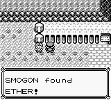
  * Say YES to Bill and then go to the cell separator.
  * Talk to Bill again to get the S.S. Anne ticket.
  * Menu
    * Heal to "full"
    * Escape Rope
  * Head to the Gym.
  * **Jr. Trainer**
    * _Goldeen Lvl 19_
    * Thrash/Thrash (cont)
  * If you have bad Attack (<52 at Lv. 23) and bad Speed (also <52), change the
    battle style to Shift before fighting Misty.
  * If you are in a race save before the fight.
  * **Misty**
    * _Staryu Lvl 18, Starmie Lvl 23_
    * **NOTE: If you get confused from Thrash, sacrifice one of your other
              pokemon, and heal Nidoking while he is out. If you used Shift
              strats, send out Squirtle for Starmie, and use Bubble until you
              get the speedfall.
    * Thrash
    * Thrash (cont)/Thrash (possibly cont)/Thrash (possibly cont)
    * _Reach Lvl 25_

## Gary 3 (Split 8)

  * If you used Shift strats on Misty, change the battle style back to Set.
  * Walk through the house on the top right and fight the Rocket.
  * **Rocket**
    * _Machop Lvl 17, Drowzee Lvl 17_
    * Thrash/Thrash (cont)
    * Thrash (possibly cont)
    * _Reach Lvl 26_
  * Head South to go to Vermillion City.
  * Enter the building in the Southeast Corner and take the stairs.
  * Pickup the Full Restore.
    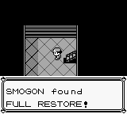
  * Go through the underground path to get to Route 6.
  * If you didn't catch a Paras in Mt. Moon and you have Pidgey, catch an Oddish
    here (Tackle once to weaken).
  * Walk through the left grass to avoid the Bug Catcher on the right.
  * Heal to 16+ HP for the female Jr. Trainer.
  * **Jr. Trainer**
    * _Pidgey Lvl 16, Pidgey Lvl 16, Pidgey Lvl 16_
    * Thrash
    * Thrash (cont)
    * Thrash (possibly cont)
  * Heal to 13+ HP for the male Jr. Trainer.
  * **Jr. Trainer**
    * _Spearow Lvl 16, Raticate Lvl 16_
    * Thrash
    * Thrash (cont)
  * Mart
    * Sell - Nugget
    * Buy - 3 Repel
  * Go to the S.S. Anne.
  * Once you are on the S.S. Anne, head to the stairs all the way to the left,
    then on the next floor head down until you can go right, then go all the
    way to the right (minus 1 block), then head up to fight Gary.
  * Heal to 35+ HP for Gary.
  * **Gary**
    * _Pidgeotto Lvl 19, Raticate Lvl 16, Kadabra Lvl 18, Ivysaur Lvl 20_
    * **NOTE: If you get sand attacked switch to your weakest pokemon.**
    * Horn Attack/Horn Attack
    * Horn Attack/Horn Attack
    * Thrash
    * Thrash (cont)/Thrash (possibly cont)
    * _Reach Lvl 27_

## Lt. Surge (Split 9)

  * Get HM01 from the Captain, then head to the Gym.
  * If you have Spearow and no Paras/Oddish, trade the Spearow for Farfetch'd
    (Dux) in the house above the cut bush blocking the gym.
  * Menu (On the tile before the Cut bush)
    * Teach Bubblebeam (TM11) over Leer.
    * Swap your slot 1 item with Repel.
    * Teach Cut (HM01) to your Cut slave.
    * Teach Dig (TM28) to Paras or Squirtle if you don't have Paras.
  * Cut the bush and enter the Gym.
  * Select the right Trash Cans to pass. 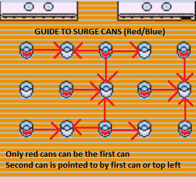
  * **Surge**
    * _Voltorb Lvl 21, Pikachu Lvl 18, Raichu Lvl 24_
    * Thrash
    * Thrash (cont)
    * Thrash (possibly cont)/Thrash (possibly cont)
    * _Reach Lvl 28_

## Rock Tunnel (Split 10)

  * Go to the house above the gym to get the bike voucher, then Dig back to
    Cerulean.
  * Go pick up the bike from the bike shop (down and to the left of the center).
  * Menu (After leaving the shop)
    * Swap your slot 2 item with the bike.
    * Teach Thunderbolt (TM24) over Poison String.
    * Get on the Bike.
  * Head to Route 9 by going down and to the right. (need to cut 2 bushes).
  * **Jr. Trainer**
    * _Oddish Lvl 18, Bellsprout Lvl 18, Oddish Lvl 18, Bellsprout Lvl 18_
    * **NOTE: If you get confused and are at low HP, switch to your weakest
              slave, then immediately switch Nidoking back in. If you get put to
              sleep, use your Full Restore.
    * Thrash
    * Thrash (cont)
    * Thrash (poss cont)
    * Thrash (poss cont)
  * **Bug Catcher**
    * _Caterpie Lvl 20, Weedle Lvl 20, Venonant Lvl 20_
    * Thunderbolt
    * Thrash
    * Thrash (cont)
    * _Reach Lvl 29_
  * Follow the map to get through, yellow is for repel, blue is for trainer.
    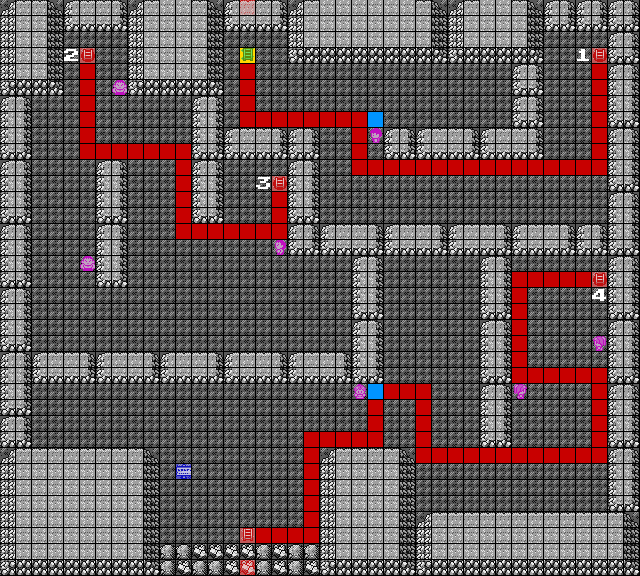
    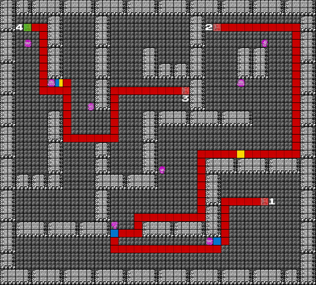
  * Use a Repel Immediately after you enter before moving.
  * Use a second Repel soon after you make the second right turn after battling
    the Jr.TrainerF on 2F.
  * Use a third Repel as you're standing next to the Hiker, then talk to him to
    battle him.
  * All trainers battled are talked to as it's faster.
  * **Pokemaniac**
    * _Cubone Lvl 23, Slowpoke Lvl 23_
    * Bubblebeam
    * Thunderbolt
  * **Pokemaniac**
    * _Slowpoke Lvl 25_
    * Thunderbolt
    * _Reach Lvl 30_
  * **Jr. Trainer**
    * _Oddish Lvl 22, Bulbasaur Lvl 22_
    * Thrash
    * Thrash (cont)
  * **Hiker**
    * _Geodude Lvl 21, Geodude Lvl 21, Graveler Lvl 21_
    * Bubblebeam
    * Bubblebeam
    * Bubblebeam
  * **Jr. Trainer**
    * _Meowth Lvl 20, Oddish Lvl 20, Pidgey Lvl 20_
    * Thrash
    * Thrash (cont)
    * Thrash (possibly cont)
    * _Reach Lvl 31_

## Gary 4 (Split 11)

  * Head towards the underground tunnel to get to Celadon City.
  * **Gambler**
    * _Growlithe Lvl 24, Vulpix Lvl 24_
    * Bubblebeam
    * Thrash
  * Take the underground path to Celadon City.
  * Pickup the hidden Elixir. 2nd to bottom row, about 4.5 seconds after the
    bike music starts.
  * Mart
    * 2F
      * Buy - TM07 (Guy on the Right), 10 Super Repels, 2 Super Potions
    * 4F
      * Buy - 1 Poke Doll
    * 6F
      * Buy - 1 Fresh Water and 1 Soda Pop
  * Give the Fresh Water and Soda to the girl for TM13 and TM48
  * Mart
    * 6F
      * Buy - 1 Fresh Water
    * 5F
      * Buy - (Guy on the Left)11 X Accuracy, 3 X Special, 6 X Speed
  * Take the elevator to 1F, then leave.
  * Bike west, Cut the bush, then go through the building and to the house to
    pick up HM02 (Fly).
  * Menu (After exiting the house)
    * Swap your slot 2 item with Super Repel.
    * Teach TM07 (Horn Drill) over Horn Attack.
    * Use a Super Repel.
    * Swap your slot 3 item with X Accuracy.
    * Teach HM02 to your flier.
    * Teach TM48 (Rock Slide) over BubbleBeam.
    * Fly to Lavender and walk to the tower.
  * **Gary**
    * _Pidgeotto Lvl 25, Gyarados Lvl 23, Growlithe Lvl 22, Kadabra Lvl 20, Ivysaur Lvl 25_
    * **NOTE: Use a potion if below 19 HP.**
    * X Accuracy
    * Horn Drill
    * Horn Drill
    * Horn Drill
    * Horn Drill
    * Horn Drill
    * _Reach Lvl 32_

## Poke Flute (Split 12)

  * Use a potion if under 24 HP.
  * **Channeler** (4th Floor)
    * _Gastly Lvl 23, Gastly Lvl 23_
    * Rock Slide
    * Rock Slide
  * Get the Elixir immediately beneath the Channeler.
  * Get the hidden Elixir on 5F. 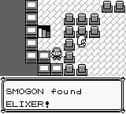
  * Take the free heal on 5F.
  * **Channeler** (6th Floor)
    * _Gastly Lvl 24_
    * Rock Slide
    * _Reach Lvl 33_
  * **Channeler 2** (6th Floor)
    * _Gastly Lvl 24_
    * Rock Slide
  * Pick up the Rare Candy that blocks the way, then enter the Ghost battle and
    escape with the Poke Doll.
  * **Rocket 1**
    * _Zubat Lvl 25, Zubat Lvl 25, Golbat Lvl 25_
    * Thunderbolt
    * Thunderbolt
    * Rock Slide
  * **Rocket 2**
    * _Koffing Lvl 26, Drowzee Lvl 26_
    * X Accuracy
    * Horn Drill
    * Horn Drill
    * _Reach Lvl 34_
  * **Rocket 3**
    * _Zubat Lvl 23, Rattata Lvl 23, Raticate Lvl 23, Zubat Lvl 23_
    * Thunderbolt
    * Thrash
    * Thrash (cont)
    * Thrash (possibly cont)
  * Talk to Mr. Fuji.
  * Talk to Mr. Fuji again to get the Poke Flute

## Sylph Co (Split 13)

  * Fly to Celadon City.
  * Use the PokeCenter.
  * Menu (After leaving the center)
    * Super Repel
    * Bike
  * Head to the Snorlax to the West.
  * Menu (Tile before Snorlax)
    * Swap your slot 4 item with X Speed.
    * Use the PokeFlute.
  * Snorlax
    * Run
  * Dodge the bikers, then go down and to the right. You want to be 4 pillars
    from the left for the upcoming Rare Candy.
  * Pickup the hidden Rare Candy.
  * Stick to the far right, and after the 2nd biker move one frame left and
    pick up the PP Up. Can go straight down from there.
    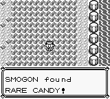
    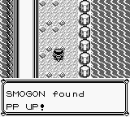
  * Menu (After exiting the Cycling Road Building)
    * Use a Super Repel.
    * Teach TM13 (Ice Beam) over Rock Slide.
  * Bike to the Safari Zone, going around the Cut bushes instead of through
    them.
  * 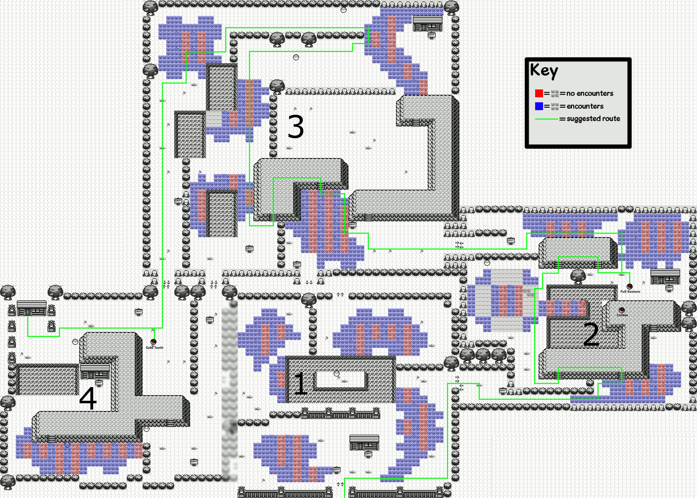
  * If you had 46 or 49 Speed at Lvl 23, get the Carbos in the Second Area.
  * Menu (At the end of the first hill in the second area)
    * Super Repel
    * Swap your slot 5 item with X Special.
    * Use the PP Up on Horn Drill
    * Use the Carbos (if you got it).
  * Get the Full Restore in Area 2.
  * In Area 4 get the Gold Teeth outside, and HM03 from the guy in the house.
  * Walk back outside and Dig back to Celadon.
  * Bike East to Silph Co, giving the fresh water to the guard in the house.
  * Enter Silph Co.

## Giovanni (Split 14)

  * Take the elevator to 10F.
  * Go down and left to fight the Rocket, avoiding the scientist.
  * **Rocket**
    * _Machoke Lvl 33_
    * X-Accuracy
    * Horn Drill
  * If you had 46, 47 or 49 Speed at Lv. 23, get the Carbos (first item below
    Rocket), and use it immediately.
  * Get the Rare Candy and TM26 (2nd and 3rd Items).
  * Take the stairs to 9F.
  * Once on 9F, teach HM03 (Surf) to Squirtle, and TM26 (Earthquake) to Nidoking
    over Thrash.
  * Hug the east wall, then the south wall, then take the teleporter to 5F.
  * Go down to fight the Rocket on 5F.
    * **Rocket**
    * _Arbok Lvl 33_
    * Earthquake
    * _Reach Lvl 35_
  * Go right to pick up the card key.
  * Take the teleporter to 9F, then take it back to 5F, then open the door to
    your left.
  * Take the teleporter to 3F.
  * Walk right, then up, then open the door to your left, and take the
    teleporter to 7F.
  * Once on 7F, walk one step up, then left to meet Gary.
  * **Gary**
    * _Pidgeot Lvl 37, Gyarados Lvl 38, Growlithe Lvl 35, Alakazam Lvl 35, Venusaur_
    * X Speed
    * X Accuracy
    * X Special
    * Thunderbolt
    * Thunderbolt
    * Horn Drill
    * Earthquake
    * Horn Drill
  * Take the teleporter to 11F.
  * **Rocket**
    * _Cubone Lvl 32, Drowzee Lvl 32, Marowak Lvl 32_
    * IceBeam
    * Earthquake
    * IceBeam
    * _Reach Lvl 37_
  * **Giovanni**
    * _Nidorino Lvl 37, Kangaskhan Lvl 35, Rhyhorn Lvl 37, Nidoqueen Lvl 41_
    * X Accuracy
    * Horn Drill
    * Horn Drill
    * Ice Beam
    * Horn Drill
    * _Reach Lvl 38_

## Koga (Split 15)
 
  * Dig back to Celadon, then Fly to Fuchsia and walk to the gym.
  * Go as far right as you can, then up, then talk to the Juggler blocking your
    path.
  * **Juggler**
    * _Drowzee Lvl 31, Drowzee Lvl 31, Kadabra Lvl 31, Drowzee Lvl 31_
    * Earthquake
    * Earthquake
    * Earthquake
    * Earthquake
    * _Reach Lvl 39_
  * Menu
    * Elixir
    * Heal to ~60 HP
  * Hug the east wall, then the north wall, then go down and let the second
    Juggler see you.
  * **Juggler 2**
    * _Drowzee Lvl 34, Hypno Lvl 34_
    * Earthquake
    * Earthquake/Thunderbolt
  * **Koga**
    * _Koffing Lvl 37, Muk Lvl 39, Koffing Lvl 37, Weezing Lvl 43_
    * Earthquake
    * Earthquake
    * Earthquake
    * Play the PokeFlute until Weezing uses SelfDestruct, hopefully killing you.
      Not dying is only a minor time loss.
    * _Reach Lvl 40_
  * If you managed your items correctly you should skip getting a TM from Koga.

## Blaine (Split 16)

  * Bike East to the Warden's house for HM04 (Strength), then Fly to Pallet
    Town.
  * Menu
    * Super Repel
    * Teach Strength (HM04) to Squirtle.
    * 3 Rare Candy (Revive and Lvl 43)
    * Bike
  * Head to the water then surf South to Cinnabar Mansion.
  * Head straight up and take the stairs.
  * On the next floor, go right five steps, then go up and take the stairs.
  * On the next floor, go down to activate the switch, then continue down to
    fall through the hole. Take 1 step down and use another Super Repel.
  * After falling, go left and down to dodge the Scientist. If you had 46, 47,
    49 or 50 Speed at Lv. 23, get the Carbos item ball. Then take the stairs to
    the right.
  * Menu (After taking the stairs)
    * Use the Carbos if you got it.
  * Activate the switch to the left, then follow the path to the northeast
    corner to activate the second switch.
  * **With a God Nido you can skip these Rare Candies**
  * Get the Rare Candy item ball in the room after the second switch.
  * Get the hidden Rare Candy.
    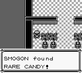
  * Use both Rare Candy (Lvl 45).
  * Get the Secret Key, then Dig out and Fly back to Cinnabar.
  * Bike to the Gym.
  * Questions: ABBBAB
  * **Blaine**
    * _Growlithe Lvl 42, Ponyta Lvl 40, Rapidash Lvl 42, Arcanine Lvl 47_
    * X Accuracy
    * Earthquake
    * Horn Drill
    * Horn Drill
    * Horn Drill

## Double Gym (Split 17)

  * Dig out.
  * If you had 46-51 Speed at Lv. 23, bike to the Celadon Gym now. If you had
    52-53 Speed, bike to the Saffron Gym.
  * **_Celadon Gym_**
  * Hug the left wall, then Cut the bush in the top-left corner.
  * **Beauty**
    * _Exeggcute Lvl 26_
    * IceBeam
  * **Erika**
    * _Victreebel Lvl 29, Tangela Lvl 24, Vileplume Lvl 29_
    * IceBeam
    * IceBeam
    * IceBeam
  * Walk out, then Fly to Saffron (if you already did Sabrina, Fly to Viridian).
  * **_Saffron Gym_**
  * Teleporters: Top-Left, Bottom-Left, Bottom-Left
  * If you had 46-48 Speed at Lv. 23, heal to 50+ HP with normal Potions (and
    save if you're in a race).
  * **Sabrina**
    * _Kadabra Lvl 38, Mr. Mime Lvl 37, Venomoth Lvl 38, Alakazam Lvl 43_
    * **NOTE: Use an X Speed on Mr. Mime if you had 46-48 Speed at Lv. 23.**
    * Earthquake
    * Earthquake
    * Earthquake
    * Earthquake
  * Dig out, then Fly to Viridian (if you didn't do Erika, bike to Erika's gym).

## Giovanni 2 (Split 18)

  * You should be between Lvl 45 and 47 depending on what kind of Nido and run
    you are doing.
  * Bike to the Gym.
  * Go left 2, then up to fight the first required trainer.
  * **Cooltrainer**
    * _Rhyhorn Lvl 43_
    * IceBeam
  * Continue left, then save before the next fight.
  * **BlackBelt**
    * _Machoke Lvl 38, Machop Lvl 38, Machoke Lvl 38_
    * X Accuracy
    * Horn Drill
    * Horn Drill
    * Horn Drill
    * _Reach Lvl 46_
  * Exit and re-enter the gym to reset Blackbelt's position and clear the path
    to Giovanni.
  * Use an Elixir.
  * **Giovanni**
    * _Rhyhorn Lvl 45, Dugtrio Lvl 42, Nidoqueen Lvl 44, Nidoking Lvl 45, Rhydon Lvl 50_
    * IceBeam
    * IceBeam
    * Earthquake
    * Earthquake
    * IceBeam/IceBeam
    * _Reach Lvl 47_

## Gary (Split 19)

  * Use a Super Repel, then bike West to Victory Road.
  * **Gary**
    * _Pidgeot Lvl 47, Rhyhorn Lvl 45, Gyarados Lvl 45, Growlithe Lvl 47, Alakazam Lvl 50, Venusaur Lvl 53_
    * **NOTE: Use X Speed instead of X Special if you had 46-48 Speed OR hit any
              extra trainers**
    * X Accuracy
    * X Special
    * IceBeam/IceBeam
    * IceBeam
    * Thunderbolt
    * Earthquake
    * Earthquake
    * Horn Drill
    * _Reach Lvl 48_

## Victory Road (Split 20)

  * Bike toward Victory Road.
  * Super Repel after leaving the water.
  * 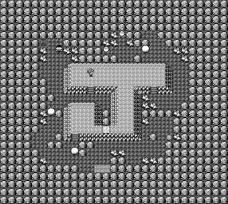
  * 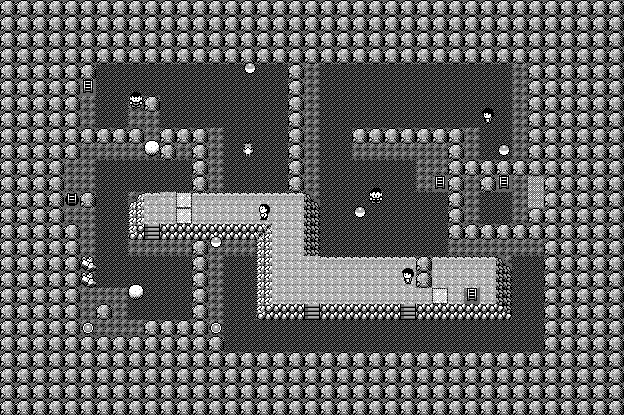
  * 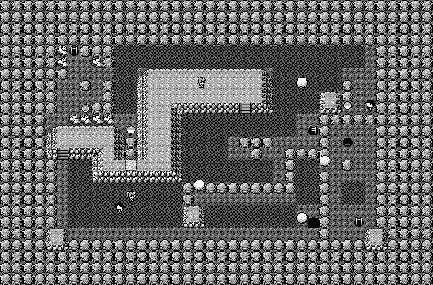
  * Use Strength upon entering.
  * Push the boulder on the left onto the switch on the right, then bike to the
    ladder in the top-left corner.
  * Use Strength again on 2F.
  * Push the boulder below onto the switch.
  * Bike up the steps so you're hugging the north edge, then use a Super Repel.
  * Bike right, then down the steps, then right and up to the ladder.
  * Use Strength again 3F.
  * Push the boulder up 2 and left a bunch, then onto the switch.
  * Bike to the boulder in the bottom-right corner, push it down the hole, then
    go down the hole.
  * Use Strength one last time, use your last Super Repel, then get on your bike
    and push the boulder onto the switch in the bottom-left.
  * Bike back to where you fell down, and follow the ladders to the exit.

## Lorelei (Split 21)

  * Buy 5 Full Restores (Can Skip if you have 2).
  * **Lorelei**
    * _Dewgong Lvl 54, Cloyster Lvl 53, Slowbro Lvl 54, Jynx Lvl 56, Lapras Lvl 56_
    * Switch to the Flier.
    * X Accuracy
    * Horn Drill
    * Horn Drill
    * Horn Drill
    * Horn Drill
    * Horn Drill
    * _Reach Lvl 50_

## Bruno (Split 22)

  * Elixir before the fight. Save if in a race.
  * **Bruno**
    * _Onix Lvl 53, Hitmonchan Lvl 55, Hitmonlee Lvl 55, Onix Lvl 56, Machamp Lvl 58_
    * X Accuracy
    * IceBeam
    * Horn Drill
    * Horn Drill
    * IceBeam
    * Horn Drill
    * _Reach Lvl 51_

## Agatha (Split 23)

  * Heal to Full.
  * **Agatha**
    * _Gengar Lvl 56, Golbat Lvl 56, Haunter Lvl 55, Arbok Lvl 58, Gengar Lvl 60_
    * **NOTE: If you get put to sleep, use the Poke Flute immediately. If you
              get Hazed, you lose your X Accuracy, so IB x2 Golbat and EQ
              Arbok.**
    * X Speed
    * Earthquake
    * Ice Beam/Ice Beam
    * Earthquake
    * Earthquake
    * Earthquake
    * _Reach Lvl 52_

## Lance (Split 24)

  * Stop at least two steps before Lance. Heal to 150+ HP, use the Ether on Horn
    Drill and save.
  * **Lance**
    * _Gyarados Lvl 58, Dragonair Lvl 56, Dragonair Lvl 56, Aerodactyl Lvl 60, Dragonite Lvl 62_
    * **NOTE: Use a second X Special on the second Dragonair if you had <44
              Special at Lv. 23 
    * X Special
    * Thunderbolt
    * Ice Beam
    * X Speed
    * Ice Beam
    * Ice Beam
    * Ice Beam
    * _Reach Lvl 53_

## Champion (Split 25)

  * Heal to 55+ HP. Use an Elixir as well.
  * **Gary**
    * _Pidgeot Lvl 61, Alakazam Lvl 59, Rhydon Lvl 61, Gyarados Lvl 61, Arcanine Lvl 63, Venusaur Lvl 65_
    * **NOTE: If Pidgeot charges Sky Attack on turn 1, use a Full Restore.**
    * X Speed
    * X Accuracy
    * Horn Drill
    * Horn Drill
    * Horn Drill
    * Horn Drill
    * Horn Drill
    * Horn Drill

## Hall of Fame (Split 26)

  * Split after fade out into credits.

[1]: http://www.speedrun.com/pkmnredblue/guide/5y94k
[2]: https://www.youtube.com/watch?v=PR1pviH6HOk&t=3069s
[3]: http://wiki.pokemonspeedruns.com/index.php/Pok%C3%A9mon_Red/Blue/Rock_Tunnel
[4]: http://www.smogon.com/oi/rby_items
[5]: https://www.twitch.com/gunnermaniac