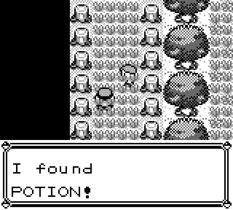

# Pokemon Red

Any% run using an emulator currently. I've based my notes off of the ones found
[here][1].

## Useful General Information

### Red Bar

Getting your health into red bar keeps pokemon from doing their cry at the
beginning of the fight. This can save a second or 2 depending on the pokemon. Of
course it's pretty risky to be at low health the whole game, but no risk no
reward after all.

### Horn Drill and X Accuracy

Horn Drill is an instant kill move, but it's really hard to hit. That is why we
use X Accuracy before using it. X Accuracy removes the accuracy check before an
attack, meaning every hit after an X Accuracy is guaranteed to land.

### Hidden Items

We collect a lot of hidden items in the route, so it's useful to know where most
of them are. I try to have images any time you need to pick something up, but
[here][4] is a good catalog of the hidden items through the game.

## Before Staring (Split 0)

  * Clear any existing save file by pressing Up + B + Select on the game title
      screen 
  * Set text speed to FAST, battle animation to OFF and battle style to SHIFT

## Gary 1 (Split 1)

  * Give yourself and rival a one character name.
  * Withdraw potion from the PC in your home.
  * Choose Squirtle (2nd pokeball) and give it a one character name.
  * **Gary**
    * _Bulbasaur Lvl 5_
    * Tail whip, then spam tackle. If growled on turn 1, then do a 2nd tail
      whip. Use a potion if under 5 HP.

## Nidoran (Split 2)

  * Head to Viridian City.
  * Fight a Lvl 2-3 Rattata or Pidgey for the experience. You need this for
    bubble to fight Brock.
  * Get Oak's Parcel from the Mart, then head back to Pallet Town to return it.
    Walk behind Oak to save some steps from Gary.
  * Head back to Viridian City.
  * Mart
    * Buy - 8 PokeBalls
  * Head west to Route 22.
  * Catch a Lvl 3 or 4 Nidoran (Male) and give it a one character name.
    * Tackle Lvl 3 Nidorans once before PokeBall. Lvl 4 just chuck a PokeBall at
      unless low on balls, then tackle twice.

## Brock (Split 3)

  * Pick up the hidden tree potion north of Viridian City.
  * Head to Viridian Forest.
  * Use this [map][2] to get through the forest with minimal battles.
  * Pick up the antidote on the way up.
  * Heal to 10+ HP for Weedle Guy and pick up the potion before him.
    
  * **Weedle Guy**
    * _Weedle Lvl 9_
    * Tail Whip x2, Tackle x4-6. If you get poisoned, wait until after the fight
      to use the Antidote. If you fall below 7 HP, use a Potion.
  * Switch Nidoran to the front.
  * Heal to 17+ HP.
  * Heal poison if necessary.
  * Continue on to Pewter Gym. Save before Brock if in a race.
  * **Brock**
    * _Geodude Lvl 12, Onyx Lvl 14_
    * Immediately switch in Squirtle.
    * Geodude - Bubble 2-3x
    * Switch in Nidoran after killing Geodude, then immediately switch Squirtle
      back in.
    * Onyx - Bubble 2-3x. If Onyx uses Bide on the turn you swap Squirtle in,
             then tail whip twice, followed by bubble.
  * [Level 8 Nidoran Stat Ranges][3]

## Mt Moon (Split 4)

  * Change the battle style to Set.
  * Mart
    * Buy - 10 Potions
  * Head to Mt. Moon
  * **_Finish enemies with tackle when it will kill. You need to save 1 horn
    attack here._**
  * **Bug Catcher 1**
    * _TODO_
    * Leer/Horn Attack/Horn Attack
    * Leer/Horn Attack/Horn Attack
    * Leer/Horn Attack/Horn Attack
  * _Save before Youngster if you are in a race_
  * **Youngster**
    * _TODO_
    * Leer/Horn Attack/Horn Attack
    * Leer/Horn Attack/Horn Attack
  * At the start of the next fight swap Horn Attack with Leer so that it is in
    move slot 1.
  * **Bug Catcher 2**
    * _TODO_
    * Horn Attack x2
    * Horn Attack x3
    * Horn Attack x2
    * Horn Attack x2
  * **Bug Catcher 3**
    * _TODO_
    * Horn Attack x2
    * Horn Attack x4
  * Catch a Spearow or a Pidgey in the grass patch ahead. Use Poison Sting to
    weaken Lv. 5 Spearows, Horn Attack to weaken Lv. 8 Pidgeys and Tackle to
    weaken everything else.
  * Use the Pokemon Center.
  * Follow the path.
    
    
    
  * _If you see a Paras catch it. Horn Attack to weaken (Tackle if Lvl
    difference is 8)._
  * Pick up TM12 (Water Gun) to the left.
  * **Super Nerd**
    * _TODO_
    * Horn Attack x3
    * Horn Attack, Horn Attack, Poison Sting
  * Pick up the Rare Candy and Escape Rope.
  * **Lass**
    * _TODO_
    * Horn Attack x3
    * Horn Attack x2
    * _You should reach Lvl 16 and evolve here._
  * Teach Water Gun over Leer.
  * **Hiker**
    * _TODO_
    * Water Gun x3
  * Pick up the Moon Stone.
  * Use the Moon Stone 1 step before fighting the Rocket.
  * **Rocket**
    * _TODO_
    * Horn Attack/Poison Sting
    * Horn Attack x2
  * **Super Nerd**
    * _TODO_
    * Horn Attack x2
    * Horn Attack x2
    * Horn Attack x2-3
  * Select the Helix Fossil
  * Exit the Cave

# Nugget Bridge (Split 5)

  * Head to Cerulean City and use the Pokemon Center.
  * Get the hidden Rare Candy behind the top-left house.
    
  * **Gary 2**
    * _TODO_
    * **NOTE: If you get sand attacked, switch to your flier and let it die.**
    * Horn Attack x3
    * Horn Attack
    * Horn Attack/Poison Sting
    * Horn Attack x2
  * **Bug Catcher**
    * _TODO_
    * Horn Attack/Poison Sting
    * Horn Attack
  * **Lass**
    * _TODO_
    * **NOTE: Keep in if sand attacked.**
    * Horn Attack/Poison Sting
    * Horn Attack x2
  * **Youngster**
    * _TODO_
    * Horn Attack
    * Horn Attack x2
    * Horn Attack x2
  * Use your 2 Rare Candies to get to Lvl 23. Note your stats to reference
    later, and teach Thrash over Poison Sting
  * **Lass**
    * _TODO_
    * Thrash x3
  * **Jr. Trainer**
    * _TODO_
    * Thrash
  * **Rocket**
    * _TODO_
    * Thrash

## Misty (Split 6)

  * Head to Bill's House.
  * Fight the bottom Hiker.
  * **Hiker**
    * _TODO_
    * ???
  * **Lass**
    * _TODO_
    * Thrash x2
  * **Jr. Trainer**
    * _TODO_
    * Thrash x2
  * **Lass**
    * Thrash x3
  * Get the hidden Ether in the wall, one up and to the right of Lass.
    
  * Say YES to Bill, heal to full, and Escape Rope back.
  * Head to the Gym.
  * **Jr. Trainer**
    * _TODO_
    * Thrash x2
  * If you have bad Attack (<52 at Lv. 23) and bad Speed (also <52), change the
    battle style to Shift before fighting Misty.
  * If you are in a race save before the fight.
  * **Misty**
    * _TODO_
    * **NOTE: If you get confused from Thrash, sacrifice one of your other
              pokemon, and heal Nidoking while he is out. If you used Shift
              strats, send out Squirtle for Starmie, and use Bubble until you
              get the speedfall.
    * Thrash
    * Thrash x3

## Gary 3 (Split 7)

  * If you used Shift strats on Misty, change the battle style back to Set.
  * Walk through the house on the top right and fight the Rocket.
  * **Rocket**
    * _TODO_
    * Thrash x3
  * Head South to go to Vermillion City.
  * Enter the building in the Southeast Corner and take the stairs.
  * Pickup the Full Restore.
    
  * Go through the underground path to get to Route 6.
  * If you didn't catch a Paras in Mt. Moon and you have Pidgey, catch an Oddish
    here (Tackle once to weaken).
  * Walk through the left grass to avoid the Bug Catcher on the right.
  * Heal to 16+ HP for the female Jr. Trainer.
  * **Jr. Trainer**
    * _TODO_
    * Thrash x3
  * Heal to 13+ HP for the male Jr. Trainer.
  * **Jr. Trainer**
    * _TODO_
    * Thrash x2
  * Mart
    * Sell - TM34, Nugger, Antidote
    * Buy - 3 Repel
  * Go to the S.S. Anne.
  * Heal to 35+ HP for Gary, and teach BubbleBeam over Tackle.
  * **Gary**
    * _TODO_
    * **NOTE: If you get sand attacked switch to your weakest pokemon.**
    * Horn Attack/BubbleBeam
    * BubbleBeam x2
    * Thrash
    * Thrash x2

## Lt. Surge (Split 8)

  * Get HM01 from the Captain, then head to the Gym.
  * If you have Spearow and no Paras/Oddish, trade the Spearow for Farfetch'd
    (Dux) in the house above the cut bush blocking the gym.
  * Menu (On the tile before the Cut bush)
    * Swap your slot 1 item with Repel.
    * Teach Cut (HM01) to your Cut slave.
    * Teach Dig (TM28) to Paras or Squirtle if you don't have Paras.
  * Cut the bush and enter the Gym.
  * Select the right Trash Cans to pass. 
  * **Surge**
    * _TODO_
    * Horn Attack/BubbleBeam
    * Thrash
    * Thrash x2

## Rock Tunnel (Split 9)

  * Go to the house above the gym to get the bike voucher, then Dig back to
    Cerulean.
  * Go pick up the bike from the bike shop.
  * Menu (After leaving the shop)
    * Swap your slot 2 item with the bike.
    * Teach Thunderbolt (TM24) over Water Gun.
    * Get on the Bike.
  * Head to Route 9 (need to cut 2 bushes).
  * **Jr. Trainer**
    * _TODO_
    * **NOTE: If you get confused and are at low HP, switch to your weakest
              slave, then immediately switch Nidoking back in. If you get put to
              sleep, use your Full Restore.
    * Thrash x4
  * **Bug Catcher**
    * _TODO_
    * Thunderbolt
    * Thrash x3
  * Use a repel before entering Rock Tunnel.
  * Use this guide for [Rock Tunnel][3].

## Mr. Fuji (Split 10)

  * Head South from Rock Tunnel and fight the Gambler.
  * **Gambler**
    * _TODO_
    * **NOTE: Use BubbleBeam on the Growlithe if you have good Special, unless
              you have good attack.
    * Thrash x3
  * Take the underground path to Celadon City.
  * Pickup the hidden Elixir. Bottom row, about 4.5 seconds after the bike music
    starts.
  * Mart
    * 2F
      * Buy - TM07, 2 Super Potions, 10 Super Repels
    * 4F
      * Buy - 1 Poke Doll
    * 6F
      * Buy - 1 Fresh Water and 1 Soda Pop
  * Give the Fresh Water and Soda to the girl for TM13 and TM48
  * Mart
    * 6F
      * Buy - 1 Fresh Water
    * 5F
      * Buy - 11 X Accuracy, 3 X Special, 6 X Speed
  * Take the elevator to 1F, then leave.
  * Bike west, Cut the bush, then go through the building and to the house to
    pick up HM02 (Fly).
  * Menu (After exiting the house)
    * Swap your slot 2 item with Super Repel.
    * Teach TM07 (Horn Drill) over Horn Attack.
    * Use a Super Repel.
    * Swap your slot 3 item with X Accuracy.
    * Teach HM02 to your flier.
    * Teach TM48 (Rock Slide) over BubbleBeam.
    * Fly to Lavender and walk to the tower.
  * **Gary**
    * _TODO_
    * **NOTE: Use a potion if below 19 HP.**
    * X Accuracy
    * Horn Drill
    * Horn Drill
    * Horn Drill
    * Horn Drill
    * Horn Drill
  * Use a potion if under 24 HP.
  * **Channeler** (4th Floor)
    * _TODO_
    * Rock Slide
    * Rock Slide
  * Get the Elixir immediately after the Channeler.
  * Get the hidden Elixir on 5F. 
  * Take the free heal on 5F.
  * **Channeler** (6th Floor)
    * _TODO_
    * Rock Slide
  * **Channeler 2** (6th Floor)
    * _TODO_
    * Rock Slide
  * Pick up the Rare Candy that blocks the way, then enter the Ghost battle and
    escape with the Poke Doll.
  * **Rocket 1**
    * _TODO_
    * ThunderBolt x2/Rock Slide
  * **Rocket 2**
    * _TODO_
    * X Accuracy
    * Horn Drill
    * Horn Drill
  * **Rocket 3**
    * _TODO_
    * Thunder Bolt x2/Thrash x3
  * Talk to Mr. Fuji.

## Silph Co (Split 11)

  * Talk to Mr. Fuji to get the Poke Flute, then Fly to Celadon City.
  * Use the PokeCenter.
  * Menu (After leaving the center)
    * Super Repel
    * Bike
  * Head to the Snorlax to the West.
  * Menu (Tile before Snorlax)
    * Swap your slot 4 item with X Speed.
    * Use the PokeFlute.
  * Snorlax
    * Run
  * Pickup the hidden Rare Candy and PP Up.
    
    
  * Menu (After exiting the Cycling Road Building)
    * Use a Super Repel.
    * Teach TM13 (Ice Beam) over Rock Slide.
  * Bike to the Safari Zone, going around the Cut bushes instead of through
    them.
  * 
  * If you had 46 or 49 Speed at Lvl 23, get the Carbos in the Second Area.
  * Menu (At the end of the first hill in the second area)
    * Super Repel
    * Swap your slot 5 item with X Special.
    * Use the PP Up on Horn Drill
    * Use the Carbos (if you got it).
  * Get the Full Restore in Area 2.
  * In Area 4 get the Gold Teeth outside, and HM03 from the guy in the house.
  * Walk back outside and Dig back to Celadon.
  * Bike East to Silph Co, giving the fresh water to the guard in the house.
  * Enter Silph Co.

## Giovanni (Split 12)

  * Take the elevator to 10F.
  * Go down and left to fight the Rocket, avoiding the scientist.
  * **Rocket**
    * _TODO_
    * IceBeam x3
  * If you had 46, 47 or 49 Speed at Lv. 23, get the Carbos (first item below
    Rocket), and use it immediately.
  * Get the Rare Candy and TM26 (2nd and 3rd Items).
  * Take the stairs to 9F.
  * Once on 9F, teach HM03 (Surf) to Squirtle, deleting Tail Whip if necessary,
    and TM26 (Earthquake) to Nidoking over Thrash.
  * Hug the east wall, then the south wall, then take the teleporter to 5F.
  * Go down to fight the Rocket on 5F (Earthquake).
  * Go right to pick up the card key.
  * Take the teleporter to 9F, then take it back to 5F, then open the door to
    your left.
  * Take the teleporter to 3F.
  * Walk right, then up, then open the door to your left, and take the
    teleporter to 7F.
  * Once on 7F, walk one step up, then left to meet Gary.
  * **Gary**
    * _TODO_
    * X Accuracy
    * X Speed
    * Horn Drill
    * Horn Drill
    * Earthquake
    * Earthquake
    * Horn Drill
  * Take the teleporter to 11F.
  * **Rocket**
    * _TODO_
    * IceBeam
    * Earthquake
    * IceBeam
  * **Giovanni**
    * _TODO_
    * X Accuracy
    * Horn Drill
    * Horn Drill
    * Ice Beam
    * Horn Drill

## Koga (Split 13)
 
  * Dig back to Celadon, then Fly to Fuchsia and walk to the gym.
  * Go as far right as you can, then up, then talk to the Juggler blocking your
    path.
  * **Juggler**
    * _TODO_
    * Earthquake
    * Earthquake
    * Earthquake
    * Earthquake
  * Menu
    * Elixir
    * Rare Candy (Lvl 40)
    * Heal to ~60 HP
  * Hug the east wall, then the north wall, then go down and let the second
    Juggler see you.
  * **Juggler 2**
    * _TODO_
    * Earthquake
    * Earthquake/Thunderbolt
  * **Koga**
    * _TODO_
    * Earthquake
    * Earthquake
    * Earthquake
    * Play the PokeFlute until Weezing uses SelfDestruct, hopefully killing you.
      Not dying is only a minor time loss.
  * If you managed your items correctly you should skip getting a TM from Koga.

## Blaine (Split 14)

  * Bike East to the Warden's house for HM04 (Strength), then Fly to Pallet
    Town.
  * Menu
    * Super Repel
    * 2 Rare Candy (Revive and Lvl 43)
    * Bike
  * Head to the water then surf South to Cinnabar Mansion.
  * Head straight up and take the stairs.
  * On the next floor, go right five steps, then go up and take the stairs.
  * On the next floor, go down to activate the switch, then continue down to
    fall through the hole.
  * After falling, go left and down to dodge the Scientist. If you had 46, 47,
    49 or 50 Speed at Lv. 23, get the Carbos item ball. Then take the stairs to
    the right.
  * Menu (After taking the stairs)
    * Super Repel
    * Teach HM04 to Squirtle over Tackle.
    * Use the Carbos if you got it.
  * Activate the switch to the left, then follow the path to the northeast
    corner to activate the second switch.
  * Get the Rare Candy item ball in the room after the second switch.
  * Get the hidden Rare Candy.
    
  * Use both Rare Candy (Lvl 45).
  * Get the Secret Key, then Dig out and Fly back to Cinnabar.
  * Bike to the Gym.
  * Questions: ABBBAB
  * **Blaine**
    * _TODO_
    * X Accuracy
    * Earthquake
    * Horn Drill
    * Horn Drill
    * Horn Drill

## Double Gym (Split 15)

  * Dig out.
  * If you had 46-51 Speed at Lv. 23, bike to the Celadon Gym now. If you had
    52-53 Speed, bike to the Saffron Gym.
  * **_Celadon Gym_**
  * Hug the left wall, then Cut the bush in the top-left corner.
  * **Beauty**
    * _TODO_
    * IceBeam
  * **Erika**
    * _TODO_
    * IceBeam
    * IceBeam
    * IceBeam
  * Walk out, then Fly to Saffron (if you already did Sabrina, Fly to Viridian).
  * **_Saffron Gym_**
  * Teleporters: Top-Left, Bottom-Left, Bottom-Left
  * If you had 46-48 Speed at Lv. 23, heal to 50+ HP with normal Potions (and
    save if you're in a race).
  * **Sabrina**
    * _TODO_
    * **NOTE: Use an X Speed on Mr. Mime if you had 46-48 Speed at Lv. 23.**
    * Earthquake
    * Earthquake
    * Earthquake
    * Earthquake
  * Dig out, then Fly to Viridian (if you didn't do Erika, bike to Erika's gym).

## Giovanni 2 (Split 16)

  * Bike to the Gym.
  * Go left 2, then up to fight the first required trainer.
  * **Cooltrainer**
    * _TODO_
    * IceBeam
  * Continue left, then save before the next fight.
  * **BlackBelt**
    * _TODO_
    * X Accuracy
    * Horn Drill
    * Horn Drill
    * Horn Drill
  * Exit and re-enter the gym to reset Blackbelt's position and clear the path
    to Giovanni.
  * Use an Elixir.
  * **Giovanni**
    * _TODO_
    * IceBeam
    * IceBeam
    * Earthquake
    * Earthquake
    * IceBeam/IceBeam

## Gary (Split 17)

  * Use a Super Repel, then bike West to Victory Road.
  * **Gary**
    * _TODO_
    * **NOTE: Use X Speed instead of X Special if you had 46-48 Speed OR hit any
              extra trainers**
    * X Accuracy
    * X Special
    * IceBeam/IceBeam
    * IceBeam
    * Thunderbolt
    * Earthquake
    * Earthquake
    * Horn Drill

## Victory Road (Split 18)

  * Bike toward Victory Road.
  * Super Repel after leaving the water.
  * 
  * 
  * 
  * Use Strength upon entering.
  * Push the boulder on the left onto the switch on the right, then bike to the
    ladder in the top-left corner.
  * Use Strength again on 2F.
  * Push the boulder below onto the switch.
  * Bike up the steps so you're hugging the north edge, then use a Super Repel.
  * Bike right, then down the steps, then right and up to the ladder.
  * Use Strength again 3F.
  * Push the boulder up 2 and left a bunch, then onto the switch.
  * Bike to the boulder in the bottom-right corner, push it down the hole, then
    go down the hole.
  * Use Strength one last time, use your last Super Repel, then get on your bike
    and push the boulder onto the switch in the bottom-left.
  * Bike back to where you fell down, and follow the ladders to the exit.

## Lorelei (Split 19)

  * Buy 5 Full Restores (Can Skip if you have 2).
  * **Lorelei**
    * _TODO_
    * Switch to the Flier.
    * X Accuracy
    * Horn Drill
    * Horn Drill
    * Horn Drill
    * Horn Drill
    * Horn Drill

## Bruno (Split 20)

  * Elixir before the fight. Save if in a race.
  * **Bruno**
    * _TODO_
    * X Accuracy
    * IceBeam
    * Horn Drill
    * Horn Drill
    * IceBeam
    * Horn Drill

## Agatha (Split 21)

  * Heal to Full.
  * **Agatha**
    * _TODO_
    * **NOTE: If you get put to sleep, use the Poke Flute immediately. If you
              get Hazed, you lose your X Accuracy, so IB x2 Golbat and EQ
              Arbok.**
    * X Accuracy
    * X Speed
    * Earthquake
    * Horn Drill
    * Earthquake
    * Horn Drill
    * Earthquake

## Lance (Split 22)

  * Stop at least two steps before Lance. Heal to 150+ HP, use the Ether on Horn
    Drill and save.
  * **Lance**
    * _TODO_
    * **NOTE: Use a second X Special on the second Dragonair if you had <44
              Special at Lv. 23 
    * X Special
    * Thunderbolt
    * X Speed
    * IceBeam
    * IceBeam
    * IceBeam
    * IceBeam

## Champion (Split 23)

  * Heal to 55+ HP.
  * **Gary**
    * _TODO_
    * **NOTE: If Pidgeot charges Sky Attack on turn 1, use a Full Restore.**
    * X Speed
    * X Accuracy
    * Horn Drill
    * Horn Drill
    * Horn Drill
    * Horn Drill
    * Horn Drill
    * Horn Drill

[1]: http://www.speedrun.com/pkmnredblue/guide/5y94k
[2]: http://wiki.pokemonspeedruns.com/index.php/Pok%C3%A9mon_Red/Blue/Viridian_Forest_Movement
[3]: http://wiki.pokemonspeedruns.com/index.php/Pok%C3%A9mon_Red/Blue/Rock_Tunnel
[4]: http://www.smogon.com/oi/rby_items