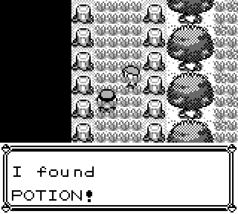
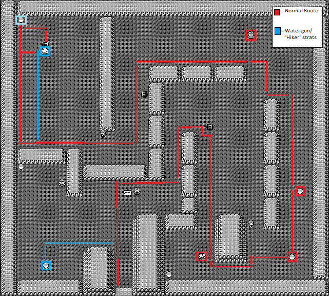
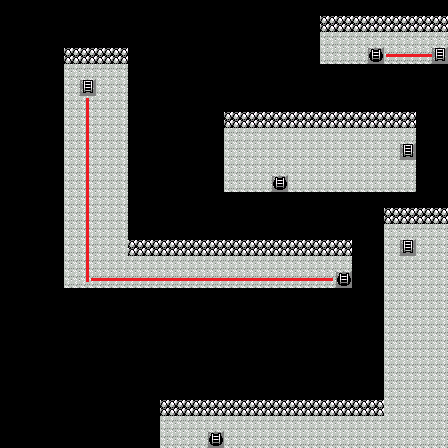
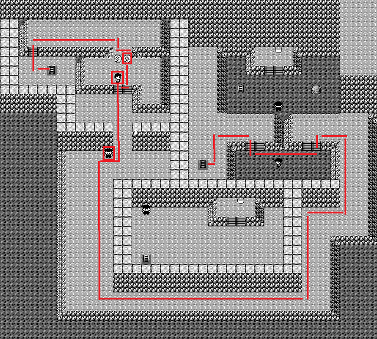

# Pokemon Red

Any% run using an emulator currently. I've based my notes off of the ones found
[here][1].

## Useful General Information

### Red Bar

Getting your health into red bar keeps pokemon from doing their cry at the
beginning of the fight. This can save a second or 2 depending on the pokemon. Of
course it's pretty risky to be at low health the whole game, but no risk no
reward after all.

## Before Staring (Split 0)

  * Clear any existing save file by pressing Up + B + Select on the game title
      screen 
  * Set text speed to FAST, battle animation to OFF and battle style to SHIFT

## Gary 1 (Split 1)

  * Give yourself and rival a one character name.
  * Withdraw potion from the PC in your home.
  * Choose Squirtle (2nd pokeball) and give it a one character name.
  * **Gary**
    * _Bulbasaur Lvl 5_
    * Tail whip, then spam tackle. If growled on turn 1, then do a 2nd tail
      whip. Use a potion if under 5 HP.

## Nidoran (Split 2)

  * Head to Viridian City.
  * Fight a Lvl 2-3 Rattata or Pidgey for the experience. You need this for
    bubble to fight Brock.
  * Get Oak's Parcel from the Mart, then head back to Pallet Town to return it.
    Walk behind Oak to save some steps from Gary.
  * Head back to Viridian City.
  * Mart
    * Buy - 8 PokeBalls
  * Head west to Route 22.
  * Catch a Lvl 3 or 4 Nidoran (Male) and give it a one character name.
    * Tackle Lvl 3 Nidorans once before PokeBall. Lvl 4 just chuck a PokeBall at
      unless low on balls, then tackle twice.

## Brock (Split 3)

  * Pick up the hidden tree potion north of Viridian City.
  * Head to Viridian Forest.
  * Use this [map][2] to get through the forest with minimal battles.
  * Pick up the antidote on the way up.
  * Heal to 10+ HP for Weedle Guy and pick up the potion before him.
    
  * **Weedle Guy**
    * _Weedle Lvl 9_
    * Tail Whip x2, Tackle x4-6. If you get poisoned, wait until after the fight
      to use the Antidote. If you fall below 7 HP, use a Potion.
  * Switch Nidoran to the front.
  * Heal to 17+ HP.
  * Heal poison if necessary.
  * Continue on to Pewter Gym. Save before Brock if in a race.
  * **Brock**
    * _Geodude Lvl 12, Onyx Lvl 14_
    * Immediately switch in Squirtle.
    * Geodude - Bubble 2-3x
    * Switch in Nidoran after killing Geodude, then immediately switch Squirtle
      back in.
    * Onyx - Bubble 2-3x. If Onyx uses Bide on the turn you swap Squirtle in,
             then tail whip twice, followed by bubble.
  * [Level 8 Nidoran Stat Ranges][3]

## Mt Moon (Split 4)

  * Change the battle style to Set.
  * Mart
    * Buy - 10 Potions
  * Head to Mt. Moon
  * **_Finish enemies with tackle when it will kill. You need to save 1 horn
    attack here._**
  * **Bug Catcher 1**
    * _TODO_
    * Leer/Horn Attack/Horn Attack
    * Leer/Horn Attack/Horn Attack
    * Leer/Horn Attack/Horn Attack
  * _Save before Youngster if you are in a race_
  * **Youngster**
    * _TODO_
    * Leer/Horn Attack/Horn Attack
    * Leer/Horn Attack/Horn Attack
  * At the start of the next fight swap Horn Attack with Leer so that it is in
    move slot 1.
  * **Bug Catcher 2**
    * _TODO_
    * Horn Attack x2
    * Horn Attack x3
    * Horn Attack x2
    * Horn Attack x2
  * **Bug Catcher 3**
    * _TODO_
    * Horn Attack x2
    * Horn Attack x4
  * Catch a Spearow or a Pidgey in the grass patch ahead. Use Poison Sting to
    weaken Lv. 5 Spearows, Horn Attack to weaken Lv. 8 Pidgeys and Tackle to
    weaken everything else.
  * Use the Pokemon Center.
  * Follow the path.
    
    
    
  * _If you see a Paras catch it. Horn Attack to weaken (Tackle if Lvl
    difference is 8)._
  * Pick up TM12 (Water Gun) to the left.
  * **Super Nerd**
    * _TODO_
    * Horn Attack x3
    * Horn Attack, Horn Attack, Poison Sting
  * Pick up the Rare Candy and Escape Rope.
  * **Lass**
    * _TODO_
    * Horn Attack x3
    * Horn Attack x2
    * _You should reach Lvl 16 and evolve here._
  * Teach Water Gun over Leer.
  * **Hiker**
    * _TODO_
    * Water Gun x3
  * Pick up the Moon Stone.
  * Use the Moon Stone 1 step before fighting the Rocket.
  * **Rocket**
    * _TODO_
    * Horn Attack/Poison Sting
    * Horn Attack x2
  * **Super Nerd**
    * _TODO_
    * Horn Attack x2
    * Horn Attack x2
    * Horn Attack x2-3
  * Select the Helix Fossil
  * Exit the Cave

# Nugget Bridge (Split 5)

  

[1]: http://www.speedrun.com/pkmnredblue/guide/5y94k
[2]: http://wiki.pokemonspeedruns.com/index.php/Pok%C3%A9mon_Red/Blue/Viridian_Forest_Movement